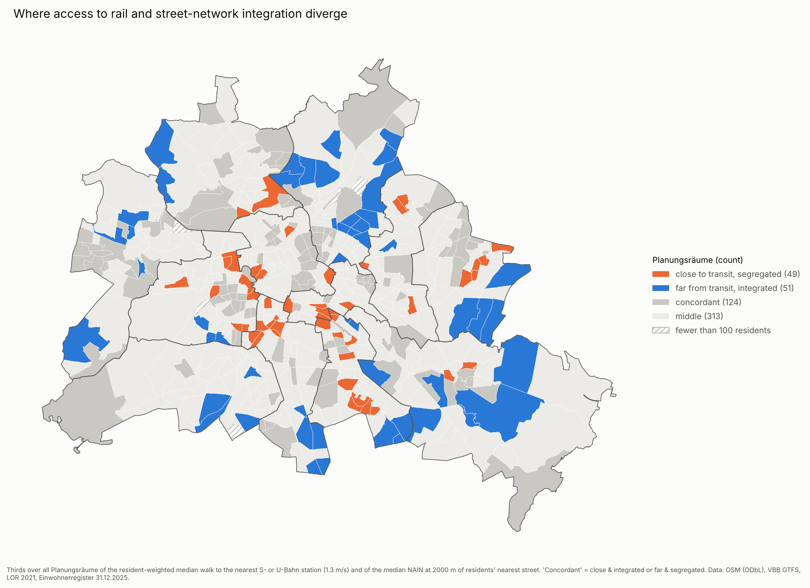

# Berlin: walking to transit, and the street network around it

How far do Berliners walk to the nearest S-Bahn, U-Bahn, tram or bus stop, and
does that metric distance agree with how central their streets are in the
street network (Space Syntax)? Every residential building in Berlin, weighted
by its residents, compared across districts and the 537 LOR Planungsräume.

> **Kurzfassung (DE):** Für jedes Wohngebäude in Berlin wird der Fußweg im
> OSM-Wegenetz zur nächsten Haltestelle je Verkehrsmittel (VBB-GTFS) berechnet und
> nach Einwohnern gewichtet pro Bezirk und Planungsraum zusammengefasst. Dazu kommt
> eine angulare Segmentanalyse (Space Syntax, NAIN/NACH) aller Straßen, eine
> Erreichbarkeitsanalyse mit dem Place Syntax Tool (Pilot Friedrichshain-Kreuzberg,
> mit Python nachgerechnet) und ein Vergleich beider Sichtweisen. Ergebnis in
> Kürze: Die angulare Integration der Wohnstraße hängt kaum mit der Entfernung zur
> S- oder U-Bahn zusammen; die Dichte des Straßennetzes deutlich stärker. Alle
> Zahlen werden per Skript aus den Dateien in `output/` erzeugt.

> **AI use:** built with substantial help from an AI coding assistant; research
> questions, methodological decisions and review are the author's. See
> [AI use disclosure](#ai-use-disclosure). *Mit Unterstützung eines
> KI-Programmierassistenten erstellt.*

## Status

| Phase | Content | Status |
|---|---|---|
| 0 | Walk time to the nearest stop per mode, resident-weighted, per district and Planungsraum | done |
| 1 | Angular segment analysis (cityseer), NAIN and NACH at 400 to 2000 m, all of Berlin | done |
| 2 | Place Syntax Tool inputs, PST run in QGIS, Python cross-check (Friedrichshain-Kreuzberg) | done |
| 3 | Metric access against configuration, per building and per Planungsraum | done |
| 4 | Shade-weighted reach (with SunWalk) | open, see issues |

## Key results

<!-- BEGIN GENERATED: key results (scripts/build_readme_tables.py) -->

Berlin, per resident, walking at 1.3 m/s:

| Nearest stop | Median walk (min) | Residents > 15 min | Residents > 30 min |
|---|---|---|---|
| S- or U-Bahn | 10.5 | 33.1% | 10.2% |
| Tram | 33.1 | 62.3% | 51.7% |
| Bus | 3.6 | 0.4% | 0.0% |
| Any mode | 3.4 | 0.3% | 0.0% |
| Frequent stop (every 10 min), any mode | 4.1 | 1.7% | 0.1% |

Median walk to S- or U-Bahn by district: from 6.6 min (Mitte) to 31.9 min (Spandau).

Phase 3, Spearman correlation between the walk to S- or U-Bahn and the home street's measures (negative: more central streets, shorter walks):

| Street measure | rho, buildings | rho, Planungsräume |
|---|---|---|
| NAIN 800 | 0.04 | -0.09 |
| NAIN 2000 | 0.04 | -0.07 |
| NACH 800 | -0.11 | -0.37 |
| NACH 2000 | -0.11 | -0.38 |
| metric closeness 800 | -0.32 | -0.21 |

<!-- END GENERATED: key results -->

What these numbers mean, and what they do not: [docs/findings.md](docs/findings.md).
All tables (per district, sensitivity runs, checks): [docs/results.md](docs/results.md).




More maps: [all modes](output/maps/plr_median_walk_all_modes.png) ·
[frequent stops only](output/maps/plr_frequent_10min_median_walk_all_modes.png) ·
[older residents](output/maps/plr_older_residents_S-or-U-Bahn.png) ·
[NACH 2000 m, Berlin](output/maps/segments_berlin_nach_2000.png) ·
[NACH 2000 m, Friedrichshain-Kreuzberg](output/maps/segments_friedrichshain-kreuzberg_nach_2000.png).
Where a mode does not run (trams in the west), a map shows the walk to the
nearest stop elsewhere: read it as "no service", not as a long walk.

## Documentation

| File | Content |
|---|---|
| [docs/methods.md](docs/methods.md) | The method as it stands: data, every step, parameters, limitations |
| [docs/findings.md](docs/findings.md) | What the results show, with the source file of every number |
| [docs/results.md](docs/results.md) | All result tables (generated) |
| [docs/validation.md](docs/validation.md) | Checks of the method and their outcome |
| [docs/decisions.md](docs/decisions.md) | Dated log of methodological decisions and why |
| [docs/pst_howto.md](docs/pst_howto.md) | Step-by-step guide for running Place Syntax Tool in QGIS |
| [docs/data_licences.md](docs/data_licences.md) | Licence and attribution of each data source, and of this repository's data |

Open questions and planned work are tracked as
[GitHub issues](https://github.com/giovanigoltara/berlin-accessibility-analysis/issues).

## Quick start

```bash
python3.11 -m venv .venv && source .venv/bin/activate
pip install -r requirements.txt
python scripts/download_data.py                  # OSM (BBBike), VBB GTFS, LOR, population into data/raw/
python scripts/run_accessibility.py              # Phase 0 (first run ~15 min, cached afterwards)
python scripts/make_maps.py                      # maps per Planungsraum
python scripts/run_segments.py --district Berlin # Phase 1, citywide segment analysis
python scripts/run_pst_inputs.py --district Friedrichshain-Kreuzberg   # Phase 2 inputs + Python reach
python scripts/compare_pst_results.py ...        # Phase 2, after running PST (see docs/pst_howto.md)
python scripts/run_phase3.py                     # Phase 3 comparison
python scripts/build_readme_tables.py            # docs/results.md and the key results above
pytest
```

Runtime: about 18 min for the first Phase 0 run and 65 min for the citywide
Phase 1 run; the rest takes minutes. Scripts restart themselves with
`PYTHONHASHSEED=0` so that network cleaning is reproducible
([validation §8](docs/validation.md#8-reproducibility-from-a-clean-clone)).
If the GTFS URL in `config.yaml` has moved, download the feed by hand from the
VBB page and save it as `data/raw/GTFS.zip`. Large inputs and caches stay in
`data/` and are never committed.

## Repository

```
config.yaml            parameters (walking speeds, thresholds, URLs, timetable day)
src/berlin_access/     library: network, GTFS modes, population, segments, PST helpers
scripts/               one script per step (see Quick start) and the checks in docs/validation.md
tests/                 unit tests and a smoke test on a bundled OSM sample
output/                result tables (CSV), maps (PNG), PST files, Phase 3 results
output/legacy/         output of the first version (v0) and its known defects
notebooks/             fussweg_oepnv.ipynb: original v0 analysis, kept for reference
                       explore_accessibility.ipynb: reads the outputs
                       reisezeiten_landmarks.ipynb: separate module, Google Maps API, not used
                       (its output is not published, see docs/data_licences.md)
docs/                  documentation (table above)
```

## Data and licences

| Data | Source | Licence |
|---|---|---|
| Walk network, buildings, street names | [OpenStreetMap](https://www.openstreetmap.org/copyright) via the [BBBike Berlin extract](https://download.bbbike.org/osm/bbbike/Berlin/) | ODbL 1.0, © OpenStreetMap contributors |
| Stops, routes, timetable | [VBB GTFS](https://unternehmen.vbb.de/digitale-services/datensaetze/), VBB Verkehrsverbund Berlin-Brandenburg GmbH | CC BY 4.0 |
| Planungsräume, Bezirksregionen, districts | [LOR 2021](https://gdi.berlin.de/services/wfs/lor_2021), Amt für Statistik Berlin-Brandenburg | CC BY 3.0 DE |
| Residents per Planungsraum | Einwohnerregisterstatistik 31.12.2025, [Amt für Statistik Berlin-Brandenburg](https://www.statistik-berlin-brandenburg.de/a-i-16-hj/) (Statistischer Bericht A I 16) | CC BY 3.0 DE |

All data were processed (filtered, reprojected, aggregated); details, the
licence evidence for each source and the required attribution are in
[docs/data_licences.md](docs/data_licences.md).

Software: [cityseer](https://cityseer.benchmarkurbanism.com/) for the segment
analysis; [Place Syntax Tool](https://github.com/SMoG-Chalmers/PST) (SMoG,
Chalmers / KTH) in QGIS for Phase 2.

## Limitations

In short: residents are placed within a Planungsraum by an OSM floor-area
estimate; stops are GTFS platforms, not entrances; only the nearest stop counts;
angular measures depend on automatic network cleaning; results depend on the
unit of analysis. Full list in [docs/methods.md](docs/methods.md#7-limitations).
The first version of this analysis had defects that affected all its numbers;
they are listed in [output/legacy/README.md](output/legacy/README.md) and
[docs/decisions.md](docs/decisions.md).

## AI use disclosure

This project was built with substantial help from an AI coding assistant
(Claude Code, by Anthropic).

- **Mine:** the research questions, every methodological decision (recorded
  with dates in [docs/decisions.md](docs/decisions.md)), the Place Syntax Tool
  runs in QGIS, and the review and acceptance of all results.
- **AI-assisted:** most of the code, the drafts of the documentation, the
  validation checks and the maps, written at my direction and reviewed by me.
- **Safeguards:** no number in the README or the documentation is typed by
  hand; all tables are generated by script from the output files, and the
  findings cite the file each number comes from. The pipeline is tested
  (GitHub Actions) and was reproduced from a clean clone
  ([validation §8](docs/validation.md#8-reproducibility-from-a-clean-clone)).
  Key steps were cross-checked against independent tools: the Place Syntax
  Tool results match a separate Python implementation exactly.

Errors in the analysis are my responsibility.

## Licence and author

- Code: MIT, see [LICENSE](LICENSE).
- Data files in `output/` (tables, GeoPackages, maps): [ODbL 1.0](https://opendatacommons.org/licenses/odbl/1-0/),
  as they are derived from OpenStreetMap. Attribution: © OpenStreetMap
  contributors; VBB Verkehrsverbund Berlin-Brandenburg GmbH; Amt für Statistik
  Berlin-Brandenburg ([details](docs/data_licences.md)).

Giovani Goltara.
