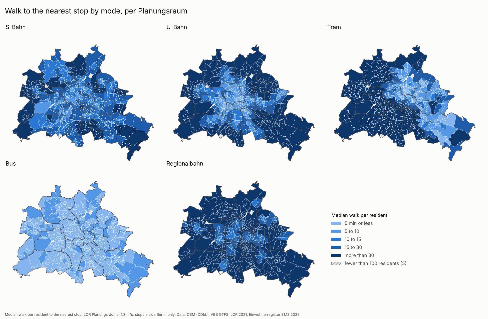
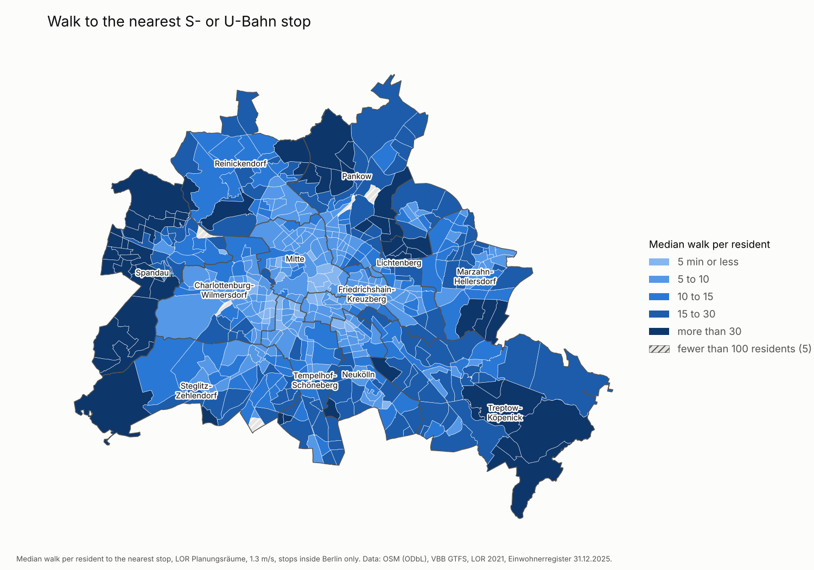
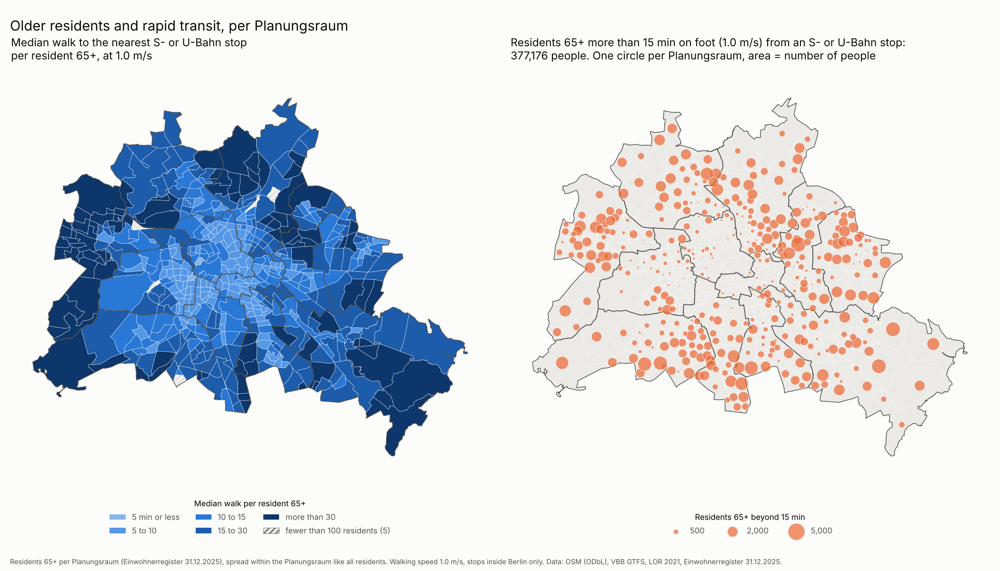
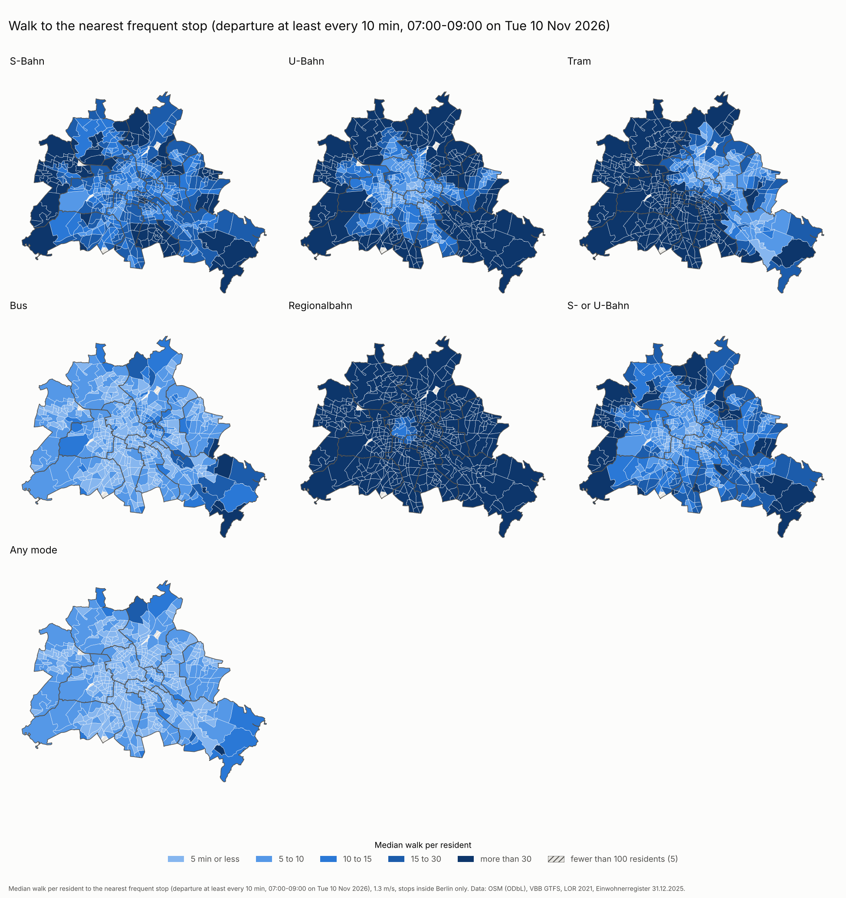
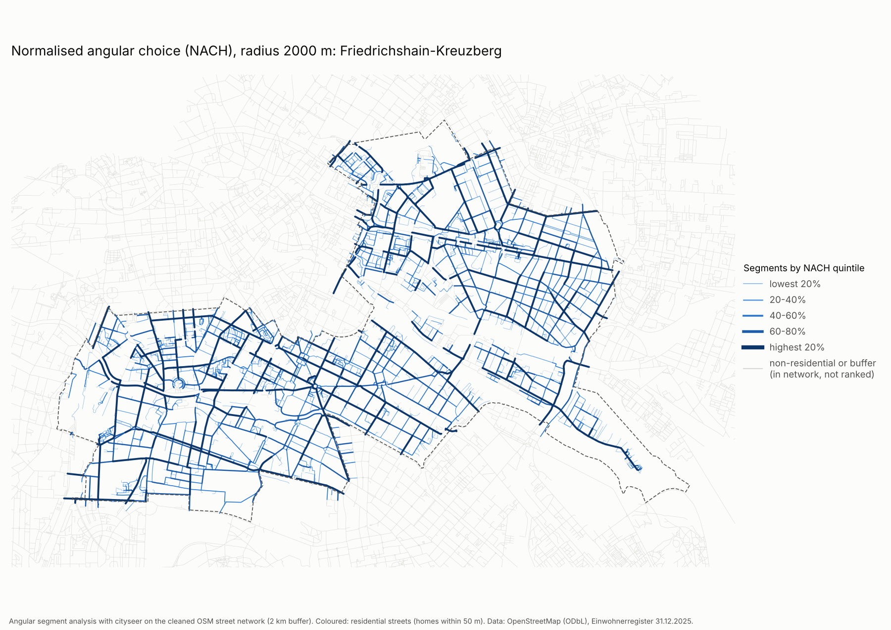

# Berlin walk-to-transit accessibility

> **Kurzfassung (DE):** Wie weit gehen Berlinerinnen und Berliner zu Fuß zur nächsten
> Haltestelle von S-Bahn, U-Bahn, Tram, Bus und Regionalbahn? Für jedes OSM-Gebäude
> wird die Fußwegdistanz im OSM-Fußwegenetz zur nächsten GTFS-Haltestelle je
> Verkehrsmittel berechnet und pro Bezirk zusammengefasst (Median, Anteil über 15 und
> 30 Minuten, Gehgeschwindigkeit 1,0 / 1,3 / 1,4 m/s). Die Tabellen unten werden aus
> den CSV-Dateien in `output/` erzeugt. Geplant: Space-Syntax-Analyse (angulare
> Segmentanalyse) und Place-Syntax-Erreichbarkeit als Vergleich.

## Purpose

How far is the nearest stop of each transit mode, on foot, from every building in
Berlin? This is a metric, network-based accessibility measure. The project will
extend it with configurational measures (angular segment analysis, Place Syntax
attraction reach) and compare the two. Status: **Phase 0** (fixing and
restructuring the original analysis), with results per district and per LOR
Planungsraum, weighted by residents. See [`docs/methods.md`](docs/methods.md) for
every methodological choice.

## Data

| Data | Source | Licence |
|---|---|---|
| Walk network, buildings | [OpenStreetMap](https://www.openstreetmap.org/copyright) via the [BBBike Berlin extract](https://download.bbbike.org/osm/bbbike/Berlin/) (covers a margin around the city) | ODbL 1.0, © OpenStreetMap contributors |
| Stops and routes | [VBB GTFS](https://www.vbb.de/vbb-services/api-open-data/datensaetze/) | VBB open data terms |
| Planungsräume, Bezirksregionen, districts | [LOR 2021](https://gdi.berlin.de/services/wfs/lor_2021), Geoportal Berlin | Berlin Open Data terms (dl-de/by-2-0) |
| Residents per Planungsraum | Einwohnerregisterstatistik 31.12.2025, [Amt für Statistik Berlin-Brandenburg](https://www.statistik-berlin-brandenburg.de/a-i-16-hj/) (Statistischer Bericht A I 16) | see publisher's terms |

Large files are downloaded into `data/raw/` and never committed:

```bash
python scripts/download_data.py      # OSM PBF (~175 MB), VBB GTFS, LOR units, population report
```

If the GTFS URL in `config.yaml` has moved, download the feed by hand from the VBB
page and save it as `data/raw/GTFS.zip`.

## Method (short)

1. OSM walking network (pyrosm), **undirected**, projected to EPSG:32633, largest
   connected component.
2. One representative point per OSM building, assigned to the LOR Planungsraum that
   contains it (and through it to its Bezirksregion and district), snapped to the
   nearest network node.
3. Residents of each Planungsraum (population register) split among its residential
   buildings by footprint x storeys; garages, sheds, allotment huts and other
   non-residential buildings get none.
4. GTFS stops classified by `route_type` (109 = S-Bahn, 400 = U-Bahn, 900 = Tram,
   100/106 = Regionalbahn, 3/700-799 = Bus). **Only stops inside Berlin** count; a
   1 km buffer is reported as a sensitivity run.
5. Multi-source Dijkstra per mode; snap distances of stop and building count towards
   the walk.
6. Per district, Bezirksregion and Planungsraum: median walk time and share of
   **residents** beyond 15 and 30 min, at 1.3 m/s (main) and 1.0 / 1.4 m/s. Building
   counts are kept as a comparison. No building is dropped for being far away.

## Run

```bash
python3.11 -m venv .venv && source .venv/bin/activate
pip install -r requirements.txt
python scripts/download_data.py
python scripts/run_accessibility.py      # writes output/*.csv and output/run_metadata.json
                                         # (first run ~15 min to parse OSM; cached afterwards)
python scripts/build_readme_tables.py    # regenerates the Results section below
python scripts/make_maps.py              # writes output/maps/*.png
pytest                                   # unit tests + smoke test on a bundled sample
```

## Results

All numbers in this section are written by `scripts/build_readme_tables.py` from
`output/*.csv`. Do not edit them by hand.

<!-- BEGIN GENERATED: results (scripts/build_readme_tables.py) -->

All tables: walking speed 1.3 m/s, only stops inside Berlin, residents allocated to buildings (see `docs/methods.md`) unless stated otherwise.

#### Median walk time to the nearest stop, per resident (minutes)

| District | S-Bahn | U-Bahn | Tram | Bus | Regionalbahn | S- or U-Bahn | Any mode |
|---|---|---|---|---|---|---|---|
| Berlin | 16.7 | 15.9 | 33.1 | 3.6 | 38.4 | 10.5 | 3.4 |
| Charlottenburg-Wilmersdorf | 13.7 | 7.8 | 59.5 | 3.3 | 26.8 | 7.0 | 3.2 |
| Friedrichshain-Kreuzberg | 15.6 | 7.4 | 17.6 | 3.5 | 24.1 | 7.1 | 3.0 |
| Lichtenberg | 14.0 | 26.3 | 6.5 | 3.9 | 25.1 | 12.2 | 3.6 |
| Marzahn-Hellersdorf | 22.0 | 31.7 | 8.7 | 4.3 | 42.4 | 13.1 | 4.1 |
| Mitte | 12.8 | 7.2 | 9.7 | 3.2 | 25.9 | 6.6 | 3.1 |
| Neukölln | 29.0 | 9.4 | 53.6 | 3.4 | 62.0 | 8.6 | 3.3 |
| Pankow | 16.7 | 24.9 | 5.7 | 4.4 | 43.1 | 14.2 | 3.5 |
| Reinickendorf | 16.8 | 25.0 | 48.3 | 3.4 | 98.4 | 13.6 | 3.4 |
| Spandau | 40.4 | 32.6 | 148.3 | 3.5 | 36.9 | 31.9 | 3.5 |
| Steglitz-Zehlendorf | 14.6 | 30.3 | 148.6 | 3.4 | 41.6 | 12.6 | 3.4 |
| Tempelhof-Schöneberg | 16.6 | 10.9 | 91.0 | 3.3 | 37.5 | 8.5 | 3.2 |
| Treptow-Köpenick | 17.8 | 66.3 | 9.6 | 3.8 | 67.4 | 17.6 | 3.7 |

#### Share of residents more than 15 min from the nearest stop

| District | S-Bahn | U-Bahn | Tram | Bus | Regionalbahn | S- or U-Bahn | Any mode |
|---|---|---|---|---|---|---|---|
| Berlin | 56.7% | 51.7% | 62.3% | 0.4% | 91.2% | 33.1% | 0.3% |
| Charlottenburg-Wilmersdorf | 42.3% | 19.8% | 100.0% | 0.2% | 81.6% | 9.0% | 0.1% |
| Friedrichshain-Kreuzberg | 52.7% | 6.3% | 54.5% | 0.0% | 82.6% | 1.2% | 0.0% |
| Lichtenberg | 45.8% | 72.3% | 12.6% | 0.3% | 75.2% | 35.9% | 0.2% |
| Marzahn-Hellersdorf | 68.3% | 70.9% | 30.1% | 0.1% | 92.2% | 43.3% | 0.1% |
| Mitte | 34.9% | 6.0% | 26.2% | 0.1% | 86.0% | 2.2% | 0.1% |
| Neukölln | 76.0% | 30.7% | 100.0% | 0.0% | 100.0% | 26.6% | 0.0% |
| Pankow | 57.7% | 67.1% | 15.8% | 0.5% | 98.5% | 47.1% | 0.4% |
| Reinickendorf | 59.9% | 69.5% | 91.9% | 0.6% | 100.0% | 43.2% | 0.6% |
| Spandau | 93.1% | 82.5% | 100.0% | 0.7% | 92.3% | 81.3% | 0.7% |
| Steglitz-Zehlendorf | 47.7% | 76.2% | 100.0% | 0.4% | 94.8% | 38.0% | 0.4% |
| Tempelhof-Schöneberg | 55.0% | 39.6% | 100.0% | 0.1% | 95.8% | 25.3% | 0.1% |
| Treptow-Köpenick | 60.4% | 100.0% | 40.0% | 1.6% | 95.3% | 60.4% | 1.1% |

#### Share of residents more than 30 min from the nearest stop

| District | S-Bahn | U-Bahn | Tram | Bus | Regionalbahn | S- or U-Bahn | Any mode |
|---|---|---|---|---|---|---|---|
| Berlin | 19.2% | 33.2% | 51.7% | 0.0% | 66.4% | 10.2% | 0.0% |
| Charlottenburg-Wilmersdorf | 0.9% | 4.7% | 96.2% | 0.0% | 43.8% | 0.0% | 0.0% |
| Friedrichshain-Kreuzberg | 9.6% | 0.5% | 32.4% | 0.0% | 26.7% | 0.0% | 0.0% |
| Lichtenberg | 13.2% | 45.0% | 0.1% | 0.0% | 44.4% | 12.5% | 0.0% |
| Marzahn-Hellersdorf | 33.7% | 51.9% | 9.6% | 0.0% | 77.0% | 6.8% | 0.0% |
| Mitte | 4.5% | 0.2% | 4.5% | 0.0% | 35.4% | 0.2% | 0.0% |
| Neukölln | 48.9% | 6.2% | 97.1% | 0.0% | 99.9% | 4.0% | 0.0% |
| Pankow | 17.5% | 42.8% | 9.9% | 0.0% | 84.2% | 17.3% | 0.0% |
| Reinickendorf | 10.4% | 40.1% | 70.8% | 0.0% | 99.0% | 9.5% | 0.0% |
| Spandau | 68.4% | 54.1% | 100.0% | 0.0% | 63.9% | 53.3% | 0.0% |
| Steglitz-Zehlendorf | 8.5% | 50.6% | 100.0% | 0.0% | 77.8% | 5.9% | 0.0% |
| Tempelhof-Schöneberg | 11.5% | 24.6% | 100.0% | 0.0% | 69.9% | 5.4% | 0.0% |
| Treptow-Köpenick | 15.6% | 94.3% | 21.8% | 0.1% | 79.5% | 15.2% | 0.0% |

#### Effect of resident weighting (building-count median minus resident median, minutes)

Positive values: counting every building once (sheds, garages, allotment huts included) makes walks look longer than residents experience them.

| District | S-Bahn | U-Bahn | Tram | Bus | Regionalbahn | S- or U-Bahn | Any mode |
|---|---|---|---|---|---|---|---|
| Berlin | +5.4 | +20.3 | +15.0 | +0.8 | +14.8 | +7.1 | +0.8 |
| Charlottenburg-Wilmersdorf | +1.2 | +4.4 | +9.2 | +0.6 | +7.1 | +2.1 | +0.6 |
| Friedrichshain-Kreuzberg | +2.7 | -0.1 | +7.9 | -0.2 | +2.0 | 0.0 | 0.0 |
| Lichtenberg | +5.5 | +13.2 | +1.9 | +0.9 | +4.5 | +5.1 | +0.9 |
| Marzahn-Hellersdorf | +3.2 | +0.2 | +8.8 | +0.2 | +4.7 | +7.0 | +0.4 |
| Mitte | -0.9 | +0.1 | +1.7 | +0.5 | -0.7 | 0.0 | +0.5 |
| Neukölln | +17.7 | +7.0 | +2.6 | +0.6 | +8.2 | +7.1 | +0.6 |
| Pankow | +8.3 | +27.0 | +6.6 | +1.0 | +11.4 | +10.4 | +1.3 |
| Reinickendorf | +1.3 | +16.6 | +28.0 | +1.2 | +26.1 | +3.0 | +1.2 |
| Spandau | +8.8 | +13.9 | +16.5 | +0.8 | +7.0 | +13.1 | +0.8 |
| Steglitz-Zehlendorf | +3.1 | +7.0 | +13.7 | +0.6 | +2.1 | +2.0 | +0.6 |
| Tempelhof-Schöneberg | +2.1 | +19.6 | +25.1 | +0.6 | +26.4 | +5.8 | +0.7 |
| Treptow-Köpenick | +5.8 | +17.3 | +7.6 | +1.4 | +18.3 | +5.8 | +1.2 |

#### Sensitivity to walking speed (Berlin, median per resident, minutes)

| Mode | 1.0 m/s | 1.3 m/s | 1.4 m/s |
|---|---|---|---|
| S-Bahn | 21.7 | 16.7 | 15.5 |
| U-Bahn | 20.7 | 15.9 | 14.8 |
| Tram | 43.0 | 33.1 | 30.7 |
| Bus | 4.7 | 3.6 | 3.3 |
| Regionalbahn | 50.0 | 38.4 | 35.7 |
| S- or U-Bahn | 13.7 | 10.5 | 9.8 |
| Any mode | 4.4 | 3.4 | 3.2 |

#### Sensitivity to the city limit: stops up to 1000 m outside Berlin also counted (change in median per resident, minutes)

| District | S-Bahn | U-Bahn | Tram | Bus | Regionalbahn | S- or U-Bahn | Any mode |
|---|---|---|---|---|---|---|---|
| Berlin | 0.0 | 0.0 | 0.0 | 0.0 | -0.1 | 0.0 | 0.0 |
| Charlottenburg-Wilmersdorf | 0.0 | 0.0 | 0.0 | 0.0 | 0.0 | 0.0 | 0.0 |
| Friedrichshain-Kreuzberg | 0.0 | 0.0 | 0.0 | 0.0 | 0.0 | 0.0 | 0.0 |
| Lichtenberg | 0.0 | 0.0 | 0.0 | 0.0 | 0.0 | 0.0 | 0.0 |
| Marzahn-Hellersdorf | -0.5 | 0.0 | 0.0 | 0.0 | 0.0 | 0.0 | 0.0 |
| Mitte | 0.0 | 0.0 | 0.0 | 0.0 | 0.0 | 0.0 | 0.0 |
| Neukölln | 0.0 | 0.0 | 0.0 | 0.0 | 0.0 | 0.0 | 0.0 |
| Pankow | -0.1 | 0.0 | 0.0 | 0.0 | 0.0 | 0.0 | 0.0 |
| Reinickendorf | 0.0 | 0.0 | 0.0 | 0.0 | 0.0 | 0.0 | 0.0 |
| Spandau | 0.0 | 0.0 | 0.0 | 0.0 | 0.0 | 0.0 | 0.0 |
| Steglitz-Zehlendorf | 0.0 | 0.0 | -8.7 | 0.0 | -0.2 | 0.0 | 0.0 |
| Tempelhof-Schöneberg | 0.0 | 0.0 | 0.0 | 0.0 | 0.0 | 0.0 | 0.0 |
| Treptow-Köpenick | -0.1 | 0.0 | 0.0 | 0.0 | -5.0 | -0.1 | 0.0 |

#### Older residents (65+) at 1.0 m/s

Walk per resident aged 65 or over, at a slower pace of 1.0 m/s. Older residents are known per Planungsraum only, so within a Planungsraum they are spread like all residents; differences from the all-resident tables at district level come from where older people live and from the slower pace.

| District | Residents 65+ | S- or U-Bahn: median | S- or U-Bahn: over 15 min | Any mode: median | Any mode: over 15 min |
|---|---|---|---|---|---|
| Berlin | 747,667 | 15.1 | 50.4% | 4.5 | 1.3% |
| Charlottenburg-Wilmersdorf | 79,712 | 9.3 | 18.4% | 4.3 | 0.5% |
| Friedrichshain-Kreuzberg | 33,171 | 9.2 | 9.6% | 4.0 | 0.0% |
| Lichtenberg | 59,778 | 15.8 | 53.8% | 4.6 | 0.7% |
| Marzahn-Hellersdorf | 65,849 | 17.6 | 59.6% | 5.3 | 0.7% |
| Mitte | 52,447 | 8.6 | 10.5% | 4.0 | 0.3% |
| Neukölln | 58,004 | 13.5 | 45.4% | 4.4 | 0.4% |
| Pankow | 64,688 | 22.1 | 69.6% | 4.7 | 2.1% |
| Reinickendorf | 62,765 | 18.0 | 62.4% | 4.7 | 2.7% |
| Spandau | 54,124 | 46.1 | 89.5% | 4.8 | 2.4% |
| Steglitz-Zehlendorf | 80,067 | 16.6 | 57.3% | 4.5 | 1.0% |
| Tempelhof-Schöneberg | 76,372 | 11.9 | 40.5% | 4.2 | 0.9% |
| Treptow-Köpenick | 60,690 | 24.7 | 76.8% | 4.9 | 3.8% |

#### Frequent stops only: median walk per resident (minutes)

Only stops with at least one departure every 10 min on average, 07:00-09:00 on Tuesday 10 November 2026 (counted per stop point and mode).

| District | S-Bahn | U-Bahn | Tram | Bus | Regionalbahn | S- or U-Bahn | Any mode |
|---|---|---|---|---|---|---|---|
| Berlin | 16.8 | 15.9 | 36.5 | 4.8 | 101.9 | 10.6 | 4.1 |
| Charlottenburg-Wilmersdorf | 13.7 | 7.8 | 70.4 | 4.4 | 74.1 | 7.0 | 4.0 |
| Friedrichshain-Kreuzberg | 15.6 | 7.4 | 18.9 | 4.9 | 59.7 | 7.1 | 3.8 |
| Lichtenberg | 14.0 | 26.3 | 7.1 | 5.4 | 132.6 | 12.2 | 4.2 |
| Marzahn-Hellersdorf | 22.0 | 31.7 | 8.8 | 5.8 | 205.7 | 13.1 | 4.8 |
| Mitte | 12.8 | 7.2 | 12.6 | 4.9 | 38.3 | 6.6 | 3.9 |
| Neukölln | 29.0 | 9.4 | 53.9 | 4.3 | 105.2 | 8.6 | 3.9 |
| Pankow | 16.7 | 24.9 | 6.2 | 6.2 | 85.5 | 14.2 | 4.0 |
| Reinickendorf | 18.1 | 25.0 | 64.1 | 4.3 | 124.7 | 14.5 | 4.2 |
| Spandau | 40.4 | 32.6 | 150.9 | 3.8 | 179.4 | 31.9 | 3.8 |
| Steglitz-Zehlendorf | 14.6 | 30.4 | 151.3 | 4.0 | 102.5 | 12.6 | 3.9 |
| Tempelhof-Schöneberg | 16.6 | 10.9 | 92.5 | 3.9 | 78.1 | 8.5 | 3.7 |
| Treptow-Köpenick | 17.9 | 66.3 | 10.8 | 6.7 | 211.3 | 17.8 | 4.7 |

#### Frequent stops only: share of residents more than 15 min away

| District | S-Bahn | U-Bahn | Tram | Bus | Regionalbahn | S- or U-Bahn | Any mode |
|---|---|---|---|---|---|---|---|
| Berlin | 57.1% | 51.7% | 65.4% | 4.9% | 99.3% | 33.5% | 1.7% |
| Charlottenburg-Wilmersdorf | 42.3% | 19.8% | 100.0% | 1.1% | 100.0% | 9.0% | 0.3% |
| Friedrichshain-Kreuzberg | 52.7% | 6.3% | 55.4% | 3.4% | 98.0% | 1.2% | 0.0% |
| Lichtenberg | 45.8% | 72.3% | 16.2% | 4.8% | 100.0% | 35.9% | 1.1% |
| Marzahn-Hellersdorf | 68.3% | 70.9% | 30.8% | 9.2% | 100.0% | 43.3% | 1.9% |
| Mitte | 34.9% | 6.0% | 41.4% | 0.5% | 94.6% | 2.2% | 0.1% |
| Neukölln | 76.0% | 30.7% | 100.0% | 0.5% | 100.0% | 26.6% | 0.5% |
| Pankow | 57.7% | 67.1% | 22.7% | 7.2% | 100.0% | 47.1% | 2.9% |
| Reinickendorf | 64.8% | 69.5% | 96.7% | 2.9% | 100.0% | 48.1% | 2.9% |
| Spandau | 93.1% | 82.5% | 100.0% | 2.8% | 100.0% | 81.3% | 2.5% |
| Steglitz-Zehlendorf | 47.7% | 76.2% | 100.0% | 2.4% | 99.5% | 38.1% | 1.1% |
| Tempelhof-Schöneberg | 55.0% | 39.7% | 100.0% | 0.1% | 100.0% | 25.4% | 0.1% |
| Treptow-Köpenick | 60.9% | 100.0% | 41.8% | 25.8% | 100.0% | 60.8% | 7.8% |

#### Frequent stops per mode (inside Berlin)

| mode | stops_used | stops_frequent | median_peak_departures |
|---|---|---|---|
| S-Bahn | 298 | 278 | 24.0 |
| U-Bahn | 384 | 372 | 24.0 |
| Tram | 804 | 631 | 18.0 |
| Bus | 6237 | 3422 | 12.0 |
| Regionalbahn | 63 | 4 | 6.0 |

#### Spread across LOR Planungsräume (median walk per resident, minutes)

Distribution over the 537 Planungsräume with at least 100 residents (5 excluded as low population). Per-unit values are in `output/walk_time_by_planungsraum.csv` and `output/walk_time_by_bezirksregion.csv`.

| Mode | Planungsräume | p10 | median | p90 | max |
|---|---|---|---|---|---|
| S-Bahn | 537 | 8.7 | 16.8 | 43.8 | 159.4 |
| U-Bahn | 537 | 5.8 | 17.1 | 75.2 | 188.3 |
| Tram | 537 | 4.7 | 36.5 | 146.9 | 268.8 |
| Bus | 537 | 2.7 | 3.7 | 5.5 | 12.0 |
| Regionalbahn | 537 | 16.9 | 39.7 | 86.1 | 192.9 |
| S- or U-Bahn | 537 | 5.6 | 11.2 | 30.6 | 158.8 |
| Any mode | 537 | 2.6 | 3.5 | 5.0 | 8.0 |

#### Phase 1: segment map and centrality per district

One citywide angular segment analysis (city + 2 km buffer, forestry tracks removed); each segment assigned to the district containing its midpoint. All streets are used for routing; statistics, rankings and maps cover residential streets only (a building with residents within 50 m).

| District | All segments | Residential segments | Residential share | Network km | Median segment m | Median NAIN 800 m | Median NAIN 2000 m | Median NACH 2000 m |
|---|---|---|---|---|---|---|---|---|
| Charlottenburg-Wilmersdorf | 9,267 | 7,416 | 80.0% | 609.4 | 58.6 | 0.843 | 0.658 | 0.922 |
| Friedrichshain-Kreuzberg | 4,806 | 4,121 | 85.7% | 289.5 | 52.4 | 0.793 | 0.663 | 0.911 |
| Lichtenberg | 10,866 | 8,627 | 79.4% | 607.6 | 50.3 | 0.804 | 0.659 | 0.878 |
| Marzahn-Hellersdorf | 12,304 | 10,020 | 81.4% | 763.8 | 54.4 | 0.773 | 0.614 | 0.894 |
| Mitte | 9,196 | 7,071 | 76.9% | 497.7 | 50.6 | 0.808 | 0.670 | 0.917 |
| Neukölln | 11,204 | 10,026 | 89.5% | 672.9 | 49.1 | 0.814 | 0.661 | 0.895 |
| Pankow | 15,510 | 13,357 | 86.1% | 1027.6 | 56.4 | 0.881 | 0.713 | 0.911 |
| Reinickendorf | 13,730 | 11,469 | 83.5% | 854.2 | 52.3 | 0.778 | 0.637 | 0.897 |
| Spandau | 12,196 | 10,269 | 84.2% | 815.3 | 57.9 | 0.812 | 0.658 | 0.886 |
| Steglitz-Zehlendorf | 13,498 | 11,691 | 86.6% | 947.6 | 59.3 | 0.838 | 0.699 | 0.923 |
| Tempelhof-Schöneberg | 10,592 | 9,151 | 86.4% | 703.5 | 57.6 | 0.831 | 0.682 | 0.911 |
| Treptow-Köpenick | 18,462 | 13,754 | 74.5% | 1079.1 | 54.5 | 0.840 | 0.683 | 0.893 |

#### Phase 1: top three named streets per district

A street's value is its highest segment; full top-10 lists in `output/segments_berlin_top10.csv`.

| District | Angular choice 2000 m | NAIN 2000 m | NAIN 800 m |
|---|---|---|---|
| Charlottenburg-Wilmersdorf | Heckerdamm, Heilmannring, Straße Des 17. Juni | Heckerdamm, Paulsborner Straße, Nestorstraße | Wiesbadener Straße, Droysenstraße, Pücklerstraße |
| Friedrichshain-Kreuzberg | Oranienstraße, Alte Jakobstraße, Alexandrinenstraße | Rudi-Dutschke-Straße, Wilhelmstraße, Oranienstraße | Holteistraße, Eldenaer Straße, Boxhagener Straße |
| Lichtenberg | Volkradstraße, Rummelsburger Straße, Sewanstraße | Gudrunstraße, Rüdigerstraße, Sewanstraße | Dorfstraße, Münsterlandstraße, Straße 3 |
| Marzahn-Hellersdorf | Quedlinburger Straße, Kastanienallee, Cottbusser Straße | Hultschiner Damm, Pilgramer Straße, Paul-Wegener-Straße | Hultschiner Damm, Akazienallee, Roedernstraße |
| Mitte | Annenstraße, Alte Jakobstraße, Fischerinsel | Wilhelmstraße, Luisenstraße, Bernauer Straße | Friedrichstraße, Französische Straße, Cornelius-Fredericks-Straße |
| Neukölln | Wutzkyallee, Sonnenallee, Hermannstraße | Groß-Ziethener Chaussee, Schönefelder Straße, Buckower Damm | Lieselotte-Berger-Straße, Treptower Straße, Elly-Heuss-Knapp-Straße |
| Pankow | Wilhelmsruher Damm, Greifswalder Straße, Quickborner Straße | Schillingweg, Alt-Karow, Blankenburger Chaussee | Schönerlinder Straße, Blankenfelder Chaussee, Schillingweg |
| Reinickendorf | Wilhelmsruher Damm, Senftenberger Ring, Treuenbrietzener Straße | Am Dachsbau, Ruppiner Chaussee, Berliner Straße; Oranienburger Chaussee | Alter Bernauer Heerweg, Am Dachsbau, Berliner Straße |
| Spandau | Sandstraße, Magistratsweg, Heerstraße | Ritterfelddamm, Seekorso, Alt-Gatow | Maximilian-Kolbe-Straße, Am Landschaftspark Gatow, Aalemannufer |
| Steglitz-Zehlendorf | Seydlitzstraße, Gallwitzallee, Osteweg | Finckensteinallee, Carstennstraße, Ringstraße | Ringstraße, Kommandantenstraße; Ringstraße, Baseler Straße |
| Tempelhof-Schöneberg | Prellerweg, Friedenfelser Straße, Dudenstraße; Kolonnenbrücke; Kolonnenstraße | Lichtenrader Damm, Rathausstraße, Barnetstraße | Lessingstraße, Horstwalder Straße, Paplitzer Straße |
| Treptow-Köpenick | Dammweg, Kiefholzstraße, Rudower Chaussee | Wendenschloßstraße, Waldstraße, Möllhausenufer; Wendenschloßstraße | Waltersdorfer Straße, Ligusterweg, Heideweg |

#### Phase 1 sanity check: where known main streets rank

Median percentile of each street's segments among the residential segments of its district (100 = most central).

| District | Street | Segments | Choice 800 m | Choice 2000 m | NACH 2000 m | NAIN 2000 m |
|---|---|---|---|---|---|---|
| Friedrichshain-Kreuzberg | Frankfurter Allee | 23 | 75.0 | 89.0 | 91.0 | 98.0 |
| Friedrichshain-Kreuzberg | Karl-Marx-Allee | 21 | 86.0 | 96.0 | 97.0 | 88.0 |
| Friedrichshain-Kreuzberg | Warschauer Straße | 13 | 49.0 | 75.0 | 78.0 | 78.0 |
| Friedrichshain-Kreuzberg | Skalitzer Straße | 26 | 62.0 | 63.0 | 64.0 | 53.0 |
| Friedrichshain-Kreuzberg | Kottbusser Damm | 11 | 63.0 | 83.0 | 81.0 | 44.0 |
| Friedrichshain-Kreuzberg | Oranienstraße | 32 | 93.0 | 94.0 | 93.0 | 85.0 |
| Friedrichshain-Kreuzberg | Gneisenaustraße | 18 | 63.0 | 80.0 | 82.0 | 76.0 |
| Friedrichshain-Kreuzberg | Yorckstraße | 21 | 79.0 | 71.0 | 70.0 | 67.0 |
| Friedrichshain-Kreuzberg | Mehringdamm | 16 | 70.0 | 80.0 | 80.0 | 66.0 |
| Friedrichshain-Kreuzberg | Petersburger Straße | 15 | 45.0 | 77.0 | 76.0 | 83.0 |
| Friedrichshain-Kreuzberg | Boxhagener Straße | 14 | 64.0 | 82.0 | 88.0 | 96.0 |
| Friedrichshain-Kreuzberg | Revaler Straße | 16 | 65.0 | 77.0 | 85.0 | 83.0 |

#### Phase 1 check: pilot run (friedrichshain-kreuzberg + 2 km) against the citywide run

Same segments matched by midpoint and length (95.3% of the pilot's segments matched). Values near 1 and 0% mean the 2 km buffer removes edge effects.

| Radius m | Measure | Matched segments | Spearman | Median relative difference |
|---|---|---|---|---|
| 800 | cc_harmonic_800_ang | 4584 | 0.997 | 1.3% |
| 800 | cc_betweenness_800_ang | 4584 | 0.997 | 0.8% |
| 800 | nain_800 | 4584 | 0.995 | 0.6% |
| 800 | nach_800 | 4584 | 0.996 | 0.2% |
| 800 | cc_harmonic_800 | 4584 | 0.999 | 0.6% |
| 800 | cc_betweenness_800 | 4584 | 0.996 | 0.6% |
| 2000 | cc_harmonic_2000_ang | 4584 | 0.996 | 1.2% |
| 2000 | cc_betweenness_2000_ang | 4584 | 0.996 | 3.2% |
| 2000 | nain_2000 | 4584 | 0.991 | 0.9% |
| 2000 | nach_2000 | 4584 | 0.995 | 0.4% |
| 2000 | cc_harmonic_2000 | 4584 | 1.000 | 0.5% |
| 2000 | cc_betweenness_2000 | 4584 | 0.996 | 0.9% |

#### GTFS stops per mode

| mode | stops_inside_berlin | stops_outside_within_sensitivity_buffer | stops_dropped_snap | stops_used | snap_m_median |
|---|---|---|---|---|---|
| S-Bahn | 298 | 16 | 0 | 298 | 21.6 |
| U-Bahn | 384 | 0 | 0 | 384 | 7.9 |
| Tram | 804 | 16 | 0 | 804 | 13.9 |
| Bus | 6237 | 589 | 0 | 6237 | 6.0 |
| Regionalbahn | 63 | 11 | 0 | 63 | 14.6 |

#### Provenance

- GTFS feed: calendar_min_start=20261006, calendar_max_end=20261212
- gtfs: downloaded 2026-10-07T11:02:32Z from https://www.vbb.de/vbbgtfs
- pbf: downloaded 2026-10-07T11:07:00Z from https://download.bbbike.org/osm/bbbike/Berlin/Berlin.osm.pbf
- lor: downloaded 2026-10-07T12:01:08Z from https://gdi.berlin.de/services/wfs/lor_2021?SERVICE=WFS&VERSION=2.0.0&REQUEST=GetFeature&TYPENAMES=lor_2021:a_lor_plr_2021&OUTPUTFORMAT=application/json&SRSNAME=EPSG:25833
- population: downloaded 2026-10-07T12:01:08Z from https://download.statistik-berlin-brandenburg.de/1df9da7ea6dbfa3a/f6ac408f14cd/SB_A01-16-00_2025h02_BE.xlsx
- Buildings: 503625 (excluded for snap distance > 250 m: 413)
- Residents: 3913644 in the register, 3913644.0 allocated to 331880 residential candidate buildings; storeys mapped for 41.8% of them
- Pipeline run: 2026-10-07T12:34:53Z

<!-- END GENERATED: results -->

### Maps per Planungsraum

Median walk per resident to the nearest stop of each mode, per LOR Planungsraum
(written by `scripts/make_maps.py` from `output/walk_time_by_planungsraum.csv`). All
maps share one scale; hatched units have fewer than 100 residents. Where a mode does
not run in an area (trams in the west, S-Bahn in Kladow), the value is the walk to the
nearest stop elsewhere, so read those areas as "no service", not as a long walk.



The "S- or U-Bahn" map is the walk to whichever rapid-transit stop is nearer. It is the
best single picture of rail access in a Kiez: a Planungsraum with a U-Bahn stop at
4 min and an S-Bahn stop at 25 min is well served, which neither single-mode map shows.



#### Older residents

Residents aged 65+ at a slower walking pace (1.0 m/s). Left: median walk to the nearest
S- or U-Bahn stop. Right: how many older residents live more than 15 min from one, as
circles sized by count (a filled map of counts would make large Planungsräume look worse
just for being large). Older residents are known per Planungsraum only and are spread
within it like all residents.



#### Frequent stops only

Only stops with a departure at least every 10 min on average in the weekday morning peak
count. This is what makes buses and trams comparable with rail: a Metrotram every 5 min
counts, a bus every 20 min does not. "Any mode" is the walk to the nearest such stop.



One map per mode, with district names:
[S- or U-Bahn](output/maps/plr_median_walk_S-or-U-Bahn.png) ·
[S-Bahn](output/maps/plr_median_walk_S-Bahn.png) ·
[U-Bahn](output/maps/plr_median_walk_U-Bahn.png) ·
[Tram](output/maps/plr_median_walk_Tram.png) ·
[Bus](output/maps/plr_median_walk_Bus.png) ·
[Regionalbahn](output/maps/plr_median_walk_Regionalbahn.png) ·
[Any mode](output/maps/plr_median_walk_Any-mode.png).
Frequent stops only: [Any mode](output/maps/plr_frequent_10min_median_walk_Any-mode.png) ·
[Bus](output/maps/plr_frequent_10min_median_walk_Bus.png) ·
[Tram](output/maps/plr_frequent_10min_median_walk_Tram.png) ·
[S- or U-Bahn](output/maps/plr_frequent_10min_median_walk_S-or-U-Bahn.png)

## Phase 1: angular segment analysis (all districts)

Space Syntax measures for every street segment in Berlin, computed with
[cityseer](https://cityseer.benchmarkurbanism.com/) on a segment map cleaned from the
same OSM data (parallel carriageways merged; sidewalks, forestry tracks and dangling
slivers removed). The whole city is one network with a 2 km buffer against edge
effects. All streets carry routes, but results are reported only for **residential
streets** (a building with residents within 50 m), per district. Angular (simplest-path) integration and choice at 400, 800,
1200 and 2000 m, metric (shortest-path) measures for contrast, and NAIN / NACH after
Hillier, Yang and Turner (2012). Method and all choices:
[`docs/methods.md`](docs/methods.md#phase-1-angular-segment-analysis-space-syntax).
The tables are in the Results section above.



Maps: Friedrichshain-Kreuzberg pilot NACH at
[800 m](output/maps/segments_friedrichshain-kreuzberg_nach_800.png); all of Berlin at
[800 m](output/maps/segments_berlin_nach_800.png) and
[2000 m](output/maps/segments_berlin_nach_2000.png) (dense at city scale).
All measures per segment: `python scripts/run_segments.py --district Berlin` writes
`output/segments_berlin.gpkg` (not committed, over 100 MB).

**Checks.**
- *Edge effects:* the pilot (district + 2 km) and the citywide run agree almost
  exactly on the same segments (table "pilot run against the citywide run" above), so
  2 km of buffer is enough.
- *Inner city:* in Friedrichshain-Kreuzberg the known main streets rank high among
  residential streets; at 2000 m their median NACH percentile ranges from 64
  (Skalitzer Straße) to 97 (Karl-Marx-Allee).
- *NACH artifact:* the top NACH values in Friedrichshain-Kreuzberg are on the Stralau
  peninsula, a small network with one way in. NACH divides choice by total depth, so
  a street every route into a small enclosed area must use scores high.
- *Forests:* the first citywide run ranked forest rides highest on integration in
  several outer districts (sparse, straight track grids). Forestry tracks are now
  removed from the network and only residential streets are reported; those forest
  rides no longer appear in the rankings.
- *Still open:* in the outer districts the top integration streets are often the
  long main roads of low-density areas (e.g. Groß-Ziethener Chaussee, Alt-Karow), and
  angular choice in Mitte is led by Annenstraße and Fischerinsel rather than the
  historic main streets. Not yet investigated; read outer-district and Mitte rankings
  with care.

## Changes from the first version (v0)

The original notebook (`notebooks/fussweg_oepnv.ipynb`, kept unchanged for
reference) had defects that affect every number it produced. Its output is in
`output/legacy/` with a list of them. In short: S-Bahn (route_type 109) was counted
as bus, rail-replacement buses named U2/U5/... as U-Bahn, the walk graph was
one-way along OSM drawing direction, walks of 30 min or more were dropped before the
median, and stops outside the boundary were ignored. The results table in the
earlier README did not come from the code at all and has been removed.

## Limitations

- Residents are placed within a Planungsraum by an OSM-based floor-area estimate.
  Storeys are mapped for only part of the buildings and mixed-use buildings count as
  residential, so the distribution *within* a Planungsraum is approximate; the total
  per Planungsraum is exact (register count).
- Comparing districts, Bezirksregionen and Planungsräume: results depend on unit size
  and shape (modifiable areal unit problem). Compare units within one level.
- Where a district has no stop of a mode (e.g. trams in the west), the value is the
  walk to the nearest stop in another district, not a meaningful service level.
- GTFS platform coordinates are used, not station entrances. For deep U-Bahn
  stations the real walk can differ.
- Nearest stop only: line count, destinations and travel time onwards are ignored.
  Frequency enters only as a yes/no filter (frequent-stops scenario), counted per stop
  point over all lines of a mode, so three lines every 30 min count like one line every
  10 min.
- Network quality depends on OSM footway mapping, which varies by area.

## Next steps

- **Phase 1:** computed for all districts on residential streets; open questions on
  outer-district and Mitte rankings (see Checks above).
- **Phase 2:** Place Syntax Tool inputs (QGIS GeoPackage) and a Python cross-check of
  attraction reach.
- **Phase 3:** per-building comparison of metric walk time and configurational
  centrality.
- **Phase 4:** shade-weighted reach (with the SunWalk project).

## Other module: travel times to landmarks

`notebooks/reisezeiten_landmarks.ipynb` queries the Google Maps Distance Matrix API
(paid) for travel times from district centroids to four landmarks. It is unchanged
and not part of the pipeline above.

## Licence and author

Code: MIT, see [LICENSE](LICENSE). Data licences as listed above.
Giovani Goltara.
